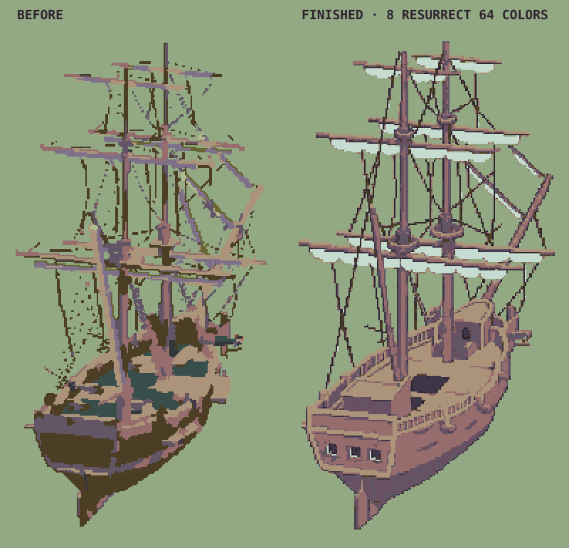
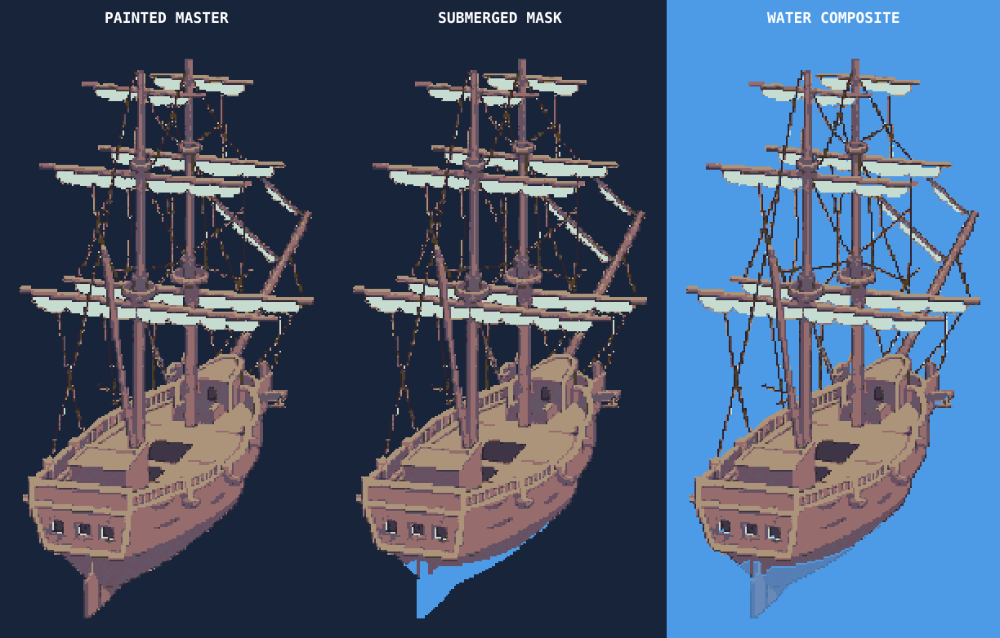

# Galleon dockside art process

The finished galleon uses broad timber planes, a few short plank indications,
three stern windows, selective rail highlights, and clear major ropes. Do not
fill its surfaces with repeated planks, grain, dithering, or small random flecks.
Match the same deliberate suggestion of detail used in the authored city buildings.



## Source and reproduction

- **Editable pixel master:** `art/ships/dockside/galleon.png`, 960×480, transparent.
  Open this directly in Aseprite. This PNG is the authoritative finished painting.
- **Geometry registration:** `art/ships/dockside/galleon-registration.json`.
- **Intermediate art reference:** `art/ships/dockside/galleon-paintover-reference.png`.
  This larger image is an intermediate, not a palette-compliant runtime asset.
- **Runtime export:** `public/assets/vehicles/unity-ships/port-assault/galleon-city-dockside.png`.
- **Layer review:** `../port-assault/galleon-dockside-compositing-review.png`.

From `apps/pixel-globe`, reproduce the complete galleon export with:

```sh
npm run render:galleon-dockside
node --test src/shipDocksidePaintover.test.js src/portAssaultShipAssets.test.js
```

This command rebuilds the galleon's model guide, applies the stored pixel master,
then derives its foreground, depth, and sink-depth masks. It refreshes its manifest
entry and the fleet color contact sheet. The complete fleet now follows the [fleet art workflow](../fleet-dockside/README.md).
The galleon sailing/profile sprites use the same eight-color art palette. Full
dockside fleet bakes apply each ship's finished painting automatically. No online service or image generation runs
during reproduction.

## Repeatable art direction for the next ship

1. Bake and inspect the canonical model orientation, fleet-relative scale,
   furled rig, selected camera, deck anchors, and waterline before painting.
   Keep the existing stern-quarter projection: 72.5° from broadside, 20° elevation.
   The galleon orientation gate is `../galleon-orientation-review.png`.
2. Crop a guide with an explicit mapping back to the original canvas. The initial
   galleon guide took `(380,115,200,360)` from the runtime raster and displayed it
   at `(100,15,400,720)` on a 600×750 canvas. Include a nearby authored building
   crop as a style reference, at a comparable pixel scale.
3. Paint over the guide in Aseprite, or use an image model for an intermediate.
   Lock mast tips, yard ends, deck levels, hull position, and camera direction.
   Judge large color masses first; add only details that clarify construction.
   Avoid trying to rescue a noisy 3D texture with a palette filter alone.
4. If starting from an enlarged image, reconstruct the intended grid before
   final pixel editing. For this galleon, use the free **Neural** engine in
   [Retro Diffusion Pixel Art Fixer](https://retrodiffusion.ai/tools/pixel-art-fixer).
   Tightly crop the accepted 1122×1402 reference at `(220,60,690,1290)` first:
   the neural tool reframed a loosely padded input, so verify proportions rather
   than trusting reported output dimensions. Set pixel size **3.74**, custom
   palette below, and dither strength **0**. The accepted output was **184×345**.
5. Remove the exact `#92a984` background swatch globally; give transparent pixels
   RGB zero. Place the result at **(389,123)** in a transparent **960×480** canvas,
   without further resizing. Save it as the pixel master. Inspect at 1× and 2×.
   The final opaque bounds are `(390,124,180,343)`; the model guide was
   `(391,125,177,340)`. Keep fleet scale and pixel density, not arbitrary full-frame fit.
6. Verify final colors, continuous major ropes, stair-step edges, clear deck
   planes, sparse detail, and no disconnected pixel dust. Test on both river
   water and a coastal city backdrop. Use the city scene's **Scene → Port ship →
   Galleon** control. The yellow ship-selection outline is existing scene UI,
   not part of this PNG.
7. Register the final painting against the model guide and inspect the derived
   foreground/depth review. Never copy an old foreground PNG over new colors.
   Keep the pipeline's palette, alpha, registration, and layer tests enabled.

## Palette

The finished ship has exactly eight opaque Resurrect 64 colors:

| Hex | Role |
| --- | --- |
| `#2e222f` | Gallery windows, hatch, deepest recesses |
| `#3e3546` | Structural darks |
| `#4c3e24` | Major ropes and dark timber |
| `#625565` | Cool hull and structural shadows |
| `#694f62` | Transitional timber shadow |
| `#966c6c` | Main hull and mast timber |
| `#ab947a` | Deck planes and rail highlights |
| `#c7dcd0` | Furled canvas and very small bright accents |

The conversion palette also contained `#92a984` exclusively as a removable
background key and `#9e4539` as an unused warm option. No dithering, antialiasing,
graded alpha, or non-palette color survives into the pixel master or color exports.

## Geometry contract and limits

The painting changes surface appearance and simplifies contour details. It does
not replace the ship's 3D hull, gameplay identity, anchors, footprint, or camera.
Source alpha, normals, world positions, and view depth are fingerprinted; a changed
model or projection fails the bake and requires a new visual registration review.
Do not blindly replace the fingerprint to silence that failure.

Opaque painted pixels over existing geometry retain their source surface sample.
New contour pixels take the nearest reviewed sample within **10 native pixels**,
with deterministic ties. Their position moves in the camera plane while retaining
that sample's depth; model height therefore follows the new pixel's actual vertical
position. Any pixel outside the reviewed radius fails the bake. This is an explicit
2.5D approximation for small painted contour changes, not exact new 3D geometry.
Large changes to hull shape, deck level, rig layout, or camera require a new model
bake and registration rather than increasing the radius.

Color, foreground occlusion, and sink-depth silhouettes are regenerated from the
same finished alpha. Water shadows retain the source model's continuous triangle
projection for the three bob states; they approximate the few-pixel art changes.
The manifest's `colorCleanup` describes the model-guide stage; `paintover` records
the final art stage, source hash, and measured registration distance. Camera and
rig-selection contact sheets remain model-space diagnostics; the fleet color and
compositing reviews show the finished painting.

## Image-model provenance and prompt

The intermediate used the built-in image generation tool, followed by Retro
Diffusion neural reconstruction and exact-palette/background conversion. Source
model attribution remains the galleon's existing creator/license attribution.

The first prompt requested a paintover of the exact model guide, with the city
building crop as style reference, no deployed sails, unchanged projection and
anchors, muted timber, cream furled canvas, light from upper right, and sparse
plank indications. Its result still contained too much grain and repeated detail.
The exact accepted prompt is stored in
`art/ships/dockside/galleon-imagegen-prompt.txt`. Its main instructions were:

> Simplify its pixel art to match the much simpler game art of the building
> reference. Keep exactly the same ship shape, size, angle, camera, rigging endpoints,
> stern shape, positions and canvas composition. The final sprite is about 180
> pixels wide and 340 pixels tall. Eliminate wood grain, dithering, microtexture,
> small highlight speckles and repeated plank seams. Use large unbroken flat
> regions: hull #966c6c; shade #625565; rails and deck #ab947a; tiny light touches
> #c7dcd0; deepest holes #2e222f; rope #4c3e24. Furled sails use #ab947a and #c7dcd0.
> Suggest hull and deck planking with only a few short disconnected lines. Make
> three simple stern windows with a highlight on one edge. Simplify deck clutter
> while preserving mast positions and deck levels. Keep major rigging as clean
> continuous single-pixel stepped lines; remove isolated pixel dust and redundant
> ropes. Use restrained, quiet broad color clusters like the building reference.
> No textured render, painting, smooth vector appearance, extra objects, or text.
> Preserve upper-right lighting and a flat background for removal.

Prompts are guidance, not validation: the model output did not satisfy exact color
or native-grid requirements until the subsequent conversion and automated checks.

## Initial paintover verification

- Ten focused paintover and fleet asset contract tests passed, including exact
  master/export equality and matching foreground, depth, and sink alpha.
- All 275 city visualizer tests passed. London river and Havana coastal scenes
  were inspected live with no browser warnings/errors.
- Source safety, catalog, and TypeScript contract checks passed; production build passed.
- Full game suite: 6,015 passed, one failed. The Bering Sea chart-distortion test
  reports 26.01px against a 26px limit and reproduces in an isolated copy of the
  unchanged HEAD sources. It is unrelated to the ship art.

## Waterline review gate (2026-09-07)

The first painted export exposed a rudder immersion defect that the small sprite
hid. Four separate effects contributed: a low estimated water plane, a normal-based
"keep decks dry" rule that misclassified the sloping rudder face, the overworld's
five-row immersion cap applied to the 960×480 dock raster, and a solid yellow
selection silhouette underneath the translucent hull. The boarding foreground
could also repaint the underwater portion opaquely.

The corrected galleon uses `waterlineBoundsRatio: 0.086` in its canonical config:
`minY + modelHeight * 0.086`, about **−0.640131** at the 2.3 model scale (previously
−0.706667). This is an art-reviewed flotation plane, not a displacement simulation.
It submerges the rudder blade and lower hull while keeping the gallery dry. The
bounds ratio scales with every bake. The deck has its own reviewed bounds ratio,
**0.18296875**; draft changes must not move the painted deck or boarding anchors.

Detailed dockside sink maps now encode actual model height without promoting
upward-facing surfaces. Runtime immersion follows the lower exterior silhouette
without the tiny-sprite depth cap or thin-column suppression. Enclosed low deck
pixels remain dry. Both the yellow highlight and boarding foreground use the dry
mask, so neither can repaint the underwater hull. Overworld readability rules
remain specific to the small sprites.

The old final mask had 191 below-water pixels, reduced to **14** in the city.
The corrected bake has **883**, of which **861** are exterior pixels rendered
underwater. The approved eight-color painting and its geometry registration are
unchanged. Rebuilt derivatives include sailing sink depth, wakes, footprints,
shadows, profile waterline metadata, and dockside masks/shadows.

When changing a ship's waterline, reproduce all dependent outputs in this order:

```sh
npm run render:galleon
npm run render:ship-layers
npm run render:galleon-dockside
npm run render:ship-waterline-review -- galleon
node tools/review-dockside-waterline.mjs galleon
node --test src/shipWaterline.test.js src/portAssaultShipAssets.test.js src/shipWaterlineReviewAssets.test.js
npm run city-visualizer:test
```

The new review command accepts any roster slug. It reads the final color and sink
bakes and writes a 2× master / submerged-mask / water-composite contact sheet to
`docs/ship-reference/port-assault/<slug>-dockside-waterline-review.png`. This is a
static diagnostic; inspect the city too, where refraction, selection, dock placement,
and boarding overlays interact. Check a river and a coastal city. Review the
rudder blade, lowest hull, dry gallery/deck, and boarding anchors before starting
that ship's paintover, then repeat after registering the finished painting.



### Waterline-fix verification

- 31 focused paintover/waterline/review tests passed; 66 derivative, packed-layer,
  ship-info, and waterline tests passed. The final seven dockside asset tests also
  confirm the profile, overworld, and dockside waterline agree.
- All 276 city tests passed, including underwater boarding-overlay compositing.
- Source/catalog/production-safety/TypeScript checks and the production build passed.
- London river and Havana coastal previews show the submerged blade without yellow
  fill, and browser diagnostics reported no warnings or errors.
- Full suite, retried serially after an unrelated horse-cart image worker stalled:
  **6,018 passed, one failed**. The only failure is the unchanged Bering Sea
  26.01px distortion result documented above. No ship or city checks failed.
