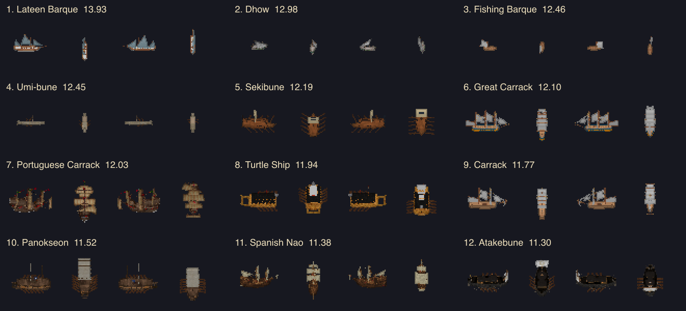

# Ship Raster Noise

Generated by `npm run analyze:ship-raster-noise`.

The score measures one-pixel color reversals, checkerboards, isolated flecks, and local color diversity only inside fully opaque 3x3 regions. This avoids penalizing legitimate silhouettes, masts, rigging, small ship size, and broad material boundaries. It is a prioritization aid; final changes still require visual review.

| Rank | Ship | Score | Micro reversals | Checkerboards | Flecks | Local diversity |
| ---: | --- | ---: | ---: | ---: | ---: | ---: |
| 1 | Lateen Barque (`ketch`) | 13.93 | 6.0% | 1.9% | 9.0% | 89.5% |
| 2 | Dhow (`dhow`) | 12.98 | 4.7% | 0.9% | 3.2% | 99.9% |
| 3 | Fishing Barque (`fishing-lugger`) | 12.46 | 6.1% | 0.0% | 3.4% | 90.4% |
| 4 | Umi-bune (`japanese-kuribune`) | 12.45 | 4.4% | 0.3% | 2.0% | 100.0% |
| 5 | Sekibune (`japanese-sekibune`) | 12.19 | 4.0% | 0.9% | 2.7% | 96.1% |
| 6 | Great Carrack (`ship-of-the-line`) | 12.10 | 4.5% | 0.4% | 7.7% | 84.5% |
| 7 | Portuguese Carrack (`portuguese-carrack`) | 12.03 | 3.1% | 0.4% | 2.7% | 99.9% |
| 8 | Turtle Ship (`joseon-turtle-ship`) | 11.94 | 3.7% | 0.2% | 5.0% | 92.4% |
| 9 | Carrack (`carrack`) | 11.77 | 5.2% | 0.6% | 5.6% | 81.4% |
| 10 | Panokseon (`joseon-panokseon`) | 11.52 | 2.8% | 0.3% | 1.3% | 99.4% |
| 11 | Spanish Nao (`spanish-nao`) | 11.38 | 3.5% | 0.5% | 3.8% | 88.9% |
| 12 | Atakebune (`japanese-atakebune`) | 11.30 | 2.0% | 0.2% | 2.0% | 99.6% |
| 13 | Urca (`fluyt`) | 11.11 | 4.1% | 0.6% | 2.6% | 85.7% |
| 14 | Galleon (`galleon`) | 10.99 | 2.0% | 0.1% | 0.3% | 99.8% |
| 15 | Ocean Dhow (`ocean-dhow`) | 10.87 | 1.5% | 0.2% | 0.8% | 99.9% |
| 16 | Mediterranean Galley (`mediterranean-galley`) | 10.78 | 1.5% | 0.1% | 0.5% | 99.8% |
| 17 | Nusantaran Outrigger (`nusantaran-outrigger`) | 10.72 | 1.4% | 0.1% | 0.5% | 100.0% |
| 18 | Polynesian Voyaging Canoe (`polynesian-voyaging-canoe`) | 10.60 | 0.9% | 0.1% | 1.0% | 99.8% |
| 19 | Kobaya (`japanese-kobaya`) | 10.51 | 0.9% | 0.1% | 0.5% | 99.9% |
| 20 | Square-Rigged Caravel (`square-rigged-caravel`) | 10.48 | 4.6% | 0.5% | 2.7% | 77.7% |
| 21 | Galleass (`galleass`) | 10.48 | 1.6% | 0.2% | 0.6% | 95.7% |
| 22 | Xebec (`xebec`) | 9.64 | 3.0% | 0.4% | 5.1% | 71.5% |
| 23 | Sampan (`sampan`) | 9.52 | 3.6% | 0.8% | 5.9% | 65.4% |
| 24 | Viking Longship (`viking-longship`) | 9.33 | 2.5% | 0.2% | 2.1% | 77.5% |
| 25 | Caravel (`caravel`) | 9.24 | 2.3% | 0.3% | 3.0% | 75.2% |
| 26 | Coastal Pinnace (`cutter`) | 9.16 | 1.1% | 0.1% | 1.7% | 83.0% |
| 27 | Brigantine (`brigantine`) | 9.07 | 3.2% | 0.3% | 5.0% | 65.5% |
| 28 | Lancaran (`lancaran`) | 9.01 | 6.2% | 0.5% | 2.5% | 56.2% |
| 29 | Heavy Caravel (`pirate-brig`) | 8.90 | 2.8% | 0.2% | 2.9% | 70.3% |
| 30 | Felucca (`felucca`) | 8.31 | 0.6% | 0.0% | 0.1% | 80.0% |
| 31 | Dugout Canoe (`mesoamerican-dugout-canoe`) | 8.19 | 0.9% | 0.0% | 0.0% | 77.7% |
| 32 | Kelulus (`kelulus`) | 7.56 | 4.3% | 0.8% | 1.5% | 51.2% |
| 33 | Kancabash (`ottoman-coastal-trader`) | 7.48 | 1.9% | 0.2% | 2.8% | 60.0% |
| 34 | Penjajap (`penjajap`) | 7.33 | 3.1% | 0.4% | 1.9% | 54.6% |
| 35 | Small Cog (`small-cog`) | 7.01 | 1.9% | 0.1% | 0.9% | 59.4% |
| 36 | Small Junk (`small-junk`) | 6.86 | 1.9% | 0.1% | 3.8% | 52.3% |
| 37 | Medium Junk (`medium-junk`) | 6.60 | 1.1% | 0.0% | 1.3% | 58.3% |
| 38 | Large Junk (`large-junk`) | 6.47 | 1.4% | 0.1% | 1.1% | 55.9% |
| 39 | Royal Lancaran (`royal-lancaran`) | 6.24 | 1.4% | 0.0% | 1.1% | 53.9% |
